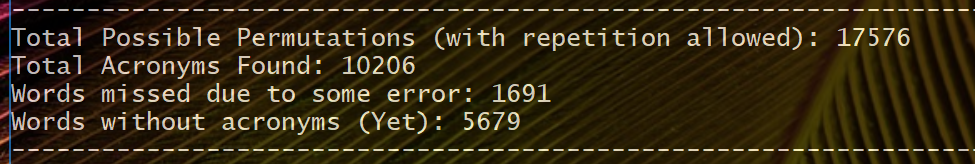

### Millenial Acronyms

Testing out combinations of all 3-letter words to see if there exists a definition for them on Urban Dictionary.  

Inspiration: A [tweet](https://twitter.com/varungrover/status/880737891969671168)  

#### Methodology:  
* Generate all 3 letter combinations for all lowercase letters using itertools.product
* Use [Urban Dictionary Unofficial API](https://market.mashape.com/community/urban-dictionary) to see if a corresponding definition exists
* Use RegEx to capture the three worded phrase corresponding to acronym

#### Results:

Existing Acronyms : [existing_acronyms.csv](existing_acronyms.csv)  
Possibly Incorrect Acronyms: [had_result.csv](had_result.csv)
No Definition (Yet) : [not_found.txt](not_found.txt)  
Missed (Due to some error): [missed.txt](missed.txt)

#### Shortcomings:
* Will miss multiple definitions for same acronym
* Did not determine if the acronym is millenial slang